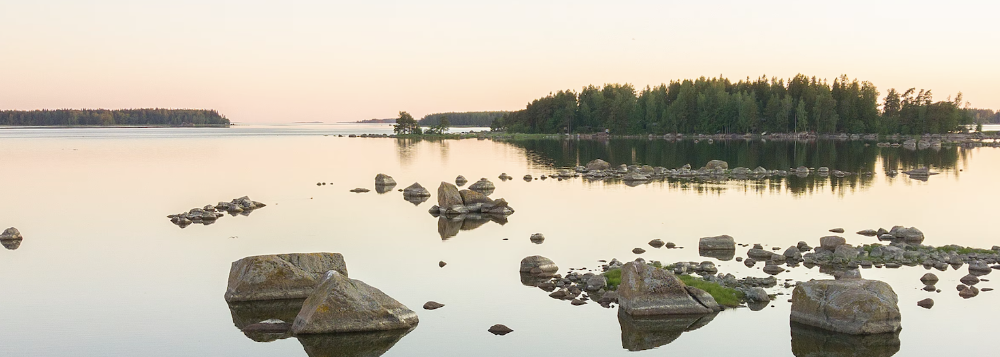
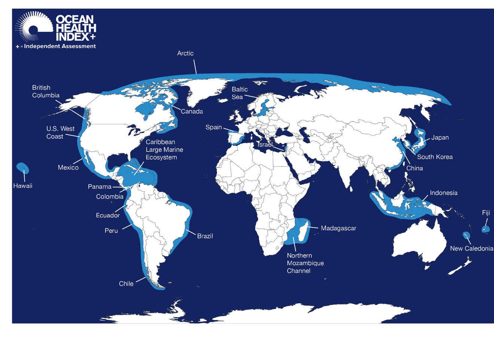

# What is the Baltic Health Index?

```{r echo = FALSE, out.width = "800px", fig.align='center', error = FALSE}
#knitr::include_graphics("https://imgs.xkcd.com/comics/correlation.png")
#options(knitr.graphics.error = FALSE)

```


The **Baltic Health Index (BHI)** is a comprehensive assessment tool that evaluates a suite of goals that sustainably deliver benefits to humans in the Baltic Sea. It can also be tailored to identify and capture important factors in different contexts. 


## Open Science {-}

The biggest motivation of the Ocean Health Index is to use the best available science, data, methods, and tools to inform marine management. OHI assessments use collaborative open software so that they are transparent and reproducible. 


## What other OHI^+^ assessments have done? {-}

What other OHI local assessments (aka OHI+) have been done, where?

- https://oceanhealthindex.org/ohi+/conduct/
- [Norway](https://github.com/OHI-Norway/)
- [Cornwall/Southwest England](https://www.ohi.sustainable-seas.org/)
- [Canada](https://github.com/OHI-Science/ohi-canada)
- [Canada-British Columbia](https://github.com/OHI-Science/ohibc)
- [Bali](http://ohi-science.org/bali/)
- [Hawaii](http://ohi-science.org/mhi/)
- [Arctic Ocean](https://github.com/OHI-Science/arc)


```{r echo = FALSE, fig.cap = 'OHI local assessments around the world.', out.width = "800px", fig.align='center', error = FALSE}
#knitr::include_graphics("https://imgs.xkcd.com/comics/correlation.png")
#options(knitr.graphics.error = FALSE)

```


