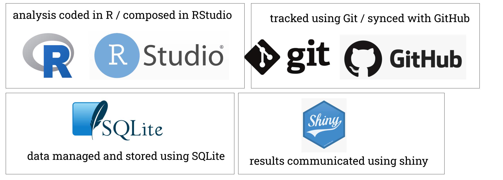

# Get set up with R, Rstudio, Git & Github


```{r echo = FALSE, out.width = "800px", fig.align='center', error = FALSE}
#knitr::include_graphics("https://imgs.xkcd.com/comics/correlation.png")
#options(knitr.graphics.error = FALSE)

```

<br>

Making OHI^+^ assessments in the Baltic Sea requires coding and using data science software. <br>
You can learn this in a fun and empowering way!

In the OHI [Open Data Science](http://ohi-science.org/data-science-training/) training book you will learn a reproducible workflow with R, RStudio, Git, and GitHub. 


But before the training, please make sure you have done the following:

1) Download and install up-to-date versions of:
   - **R**: https://cloud.r-project.org
   - **RStudio**: http://www.rstudio.com/download
   - **Git**: https://git-scm.com/downloads _Note: open the download and follow normal install procedures on your computer but you won’t see any software installed when you’re done_
2) Create a **GitHub account**: https://github.com _Note: shorter names can identify you are better, and use your work email!_
3) Get comfortable: if you’re not in a physical workshop, be set up with two screens if possible. You will be following along in RStudio on your own computer while also watching a virtual training or following this tutorial on your own.


## Further Trainings and Learning {-}

- [OHI Intro to Data Science Training Youtube series](https://youtube.com/playlist?list=PLX7J3qtjcll_4s2oaKHuWdRdBMJz7tBAU&si=NIoCjH-AuOM-rWkI), where you will learn more about collaborative tools.
- [Swirl](https://swirlstats.com/), where you can learn R programming and data science interactively, at your own pace, and right in the R console!
- [Stat545](https://stat545.com), where you will explore, groom, visualize, and analyze data, make all of that reproducible, reusable, and shareable using R.
- [R for Data Science](https://r4ds.hadley.nz), a book that will teach you how to do data science with R.
- [Improving collaboration with Github](https://openscapes.github.io/series/core-lessons/github/github-issues.html), where you learn to use Github for communication and project management through GitHub Issues.
- [Reproducible Research Techniques](https://learning.nceas.ucsb.edu/2021-11-RRCourse/),to help researchers with good data science skills, share data with the scientific community effectively and efficiently, and benefit from the re-use of their data by others.  


