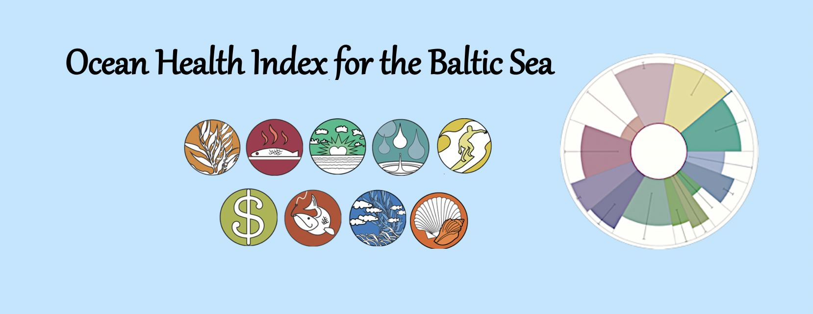
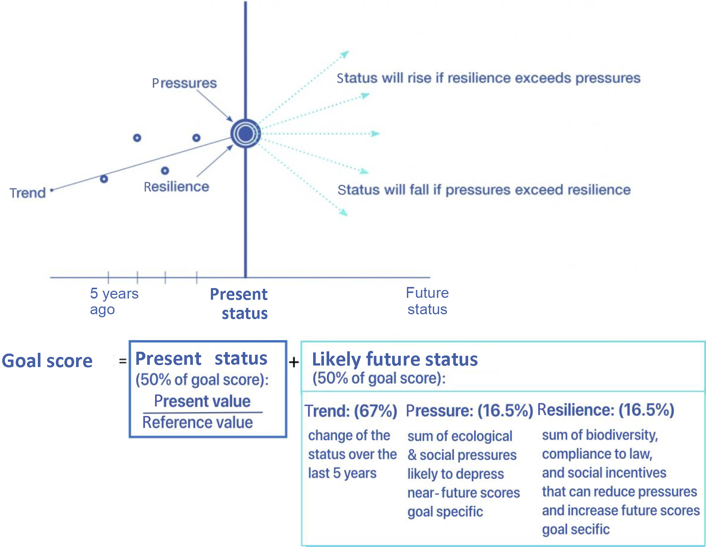

# Underlying theory, concepts and framework


```{r echo = FALSE, out.width = "800px", error = FALSE}
#knitr::include_graphics("https://imgs.xkcd.com/comics/correlation.png")
#options(knitr.graphics.error = FALSE)

```

The OHI framework categorizes **goals** and **sub-goals** representing ocean-derived benefits to people. <br>

When creating the framework, scientists, economists, and sociologists review existing studies of what people want and expect from the ocean and then group them these categories called ‘goals.’

Each goal is scored on the delivery of specific benefits with respect to a sustainable target. A goal is given a score of 100 if the management target (decided in (inter-) national or local management agencies or co-developed in common stakeholder workshops) is reached. Lower scores indicate that the decided management targets have not been reached.  

## Dimensions of the Index {-}

Goal Scores are based on several components: current status, likely future status, trend, pressures, and resilience.

To calculate each Goal Score we average the **Present Status** and **Likely Future Status**:

- **PRESENT STATUS** is a goal’s current value compared to its reference point, resulting in a score from 0 to 100.

- **LIKELY FUTURE STATUS** is the predicted status score five years into the future (once again, on a scale from 0 to 100), which is estimated by adjusting the current status score by 3 variables:

    - **TREND** indicates in which direction (improvement or decline of the status over time) the goal indicators are moving.
    - **PRESSURES** which are the ecological and social factors that decrease a goal’s status.
    - **RESILIENCE** indicates how much ecological factors (diversity) and social initiatives (policies, regulations, etc.) buffer the pressures acting on a goal.


```{r echo = FALSE, out.width = "800px", fig.align='center', fig.cap = 'OHI representation of how each goal score is calculated', error = FALSE}
#knitr::include_graphics("https://imgs.xkcd.com/comics/correlation.png")
#options(knitr.graphics.error = FALSE)

```

<br>

---------------------------------------

## Glossary {-}

- **Region’s Index Score**: the average of its goal scores. Goal scores are weighted equally in regional and global assessments, but independent assessments could weight them differently depending on local conditions and values.
- ...


