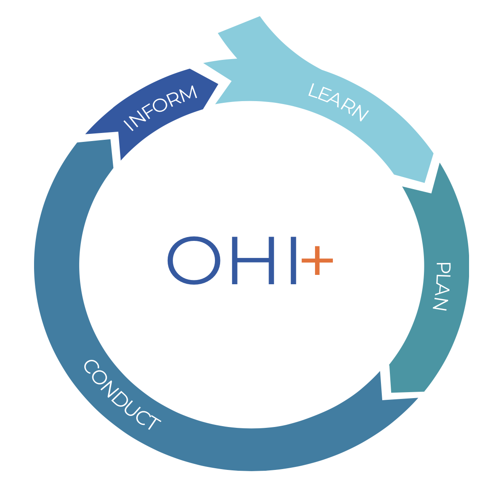

--- 
title: "Baltic Health Index Toolbox Manual"
author: "Baltic Health Index Team"
date: "`r Sys.Date()`"
site: bookdown::bookdown_site
output: bookdown::gitbook
documentclass: book
bibliography: [book.bib, packages.bib]
biblio-style: apalike
# url: your book url like https://bookdown.org/yihui/bookdown
# cover-image: path to the social sharing image like images/cover.jpg
link-citations: yes
github-repo: OHI-Baltic/bhi-local-manual
description: |
  This is the official Baltic Health Index Toolbox Manual.
---

# Welcome

Hi! <br>  
This manual is the Toolbox Manual for the Baltic Health Index (BHI). <br> 
It takes inspiration from the [Ocean Health Index Toolbox Training](http://ohi-science.org/toolbox-training/) and it is adapted according to the unique features of the Baltic Sea.
It will improve iteratively and the most recent version will always openly be available online.

The aim of this manual is to help you get “on board” with [Ocean Health Index (OHI)](http://ohi-science.org) methods and practices as you lead your own independent OHI assessment (OHI^+^) in the Baltic Sea. 

The OHI process has 4 steps: **Learn**, **Plan**, **Conduct**, and **Inform**. These steps are overlapping and iterative: as you plan your assessment you will continue to learn, as you conduct your assessment you will need to modify your plan and keep team members and stakeholders informed.  

```{r echo = FALSE, out.width = "500px", fig.align='center', error = FALSE}
#knitr::include_graphics("https://imgs.xkcd.com/comics/correlation.png")
#options(knitr.graphics.error = FALSE)

```

